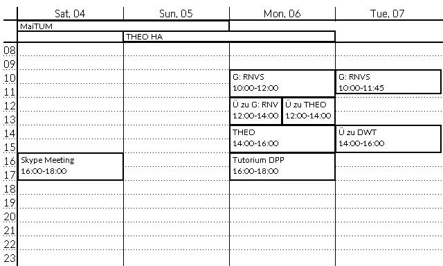

# epaper-calendar
RasPi-powered e-paper calendar using python and [Waveshare's 7.5" e-paper display](https://www.waveshare.com/product/mini-pc/raspberry-pi/displays/e-paper/7.5inch-e-paper-hat.htm)

## Demonstration
This is a screenshot of what's showing on the screen (generated by Pillow) and how neat that actually looks on the epaper! ;)




## Dependencies
- Pillow (tested with version 6.0.0; version 4 does **not** work) *(installable via pip, the version from raspbian repos is outdated)*
- [irgangla's iCal library](https://github.com/irgangla/icalevents) *(installable via pip)*
- [Waveshare e-paper library](https://github.com/waveshare/e-Paper) *(current version at development time included in this repo)*

## Configuration
The calendar data is pulled from the internet via an iCal Link. This link has to be provided in a `config.ini` file:
```
[DEFAULT]
URL=https://url.com/calendar/123
```
Replace the URL with you calendar's URL and place it alongside the python files.

More options will be moved to the config file soon^(TM)

## Code structure
Currently the main file is `beautiful_calendar.py`, it contains all the drawing work. iCal operations and event preparation are outsourced to `ical_worker.py`.
To run the program, execute `beautiful_calendar.py` using python 3!

